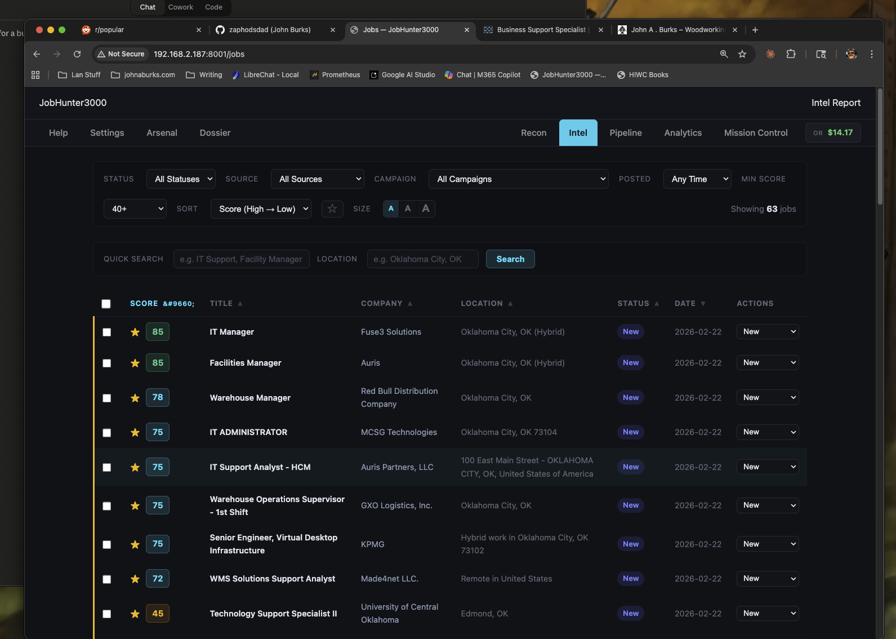
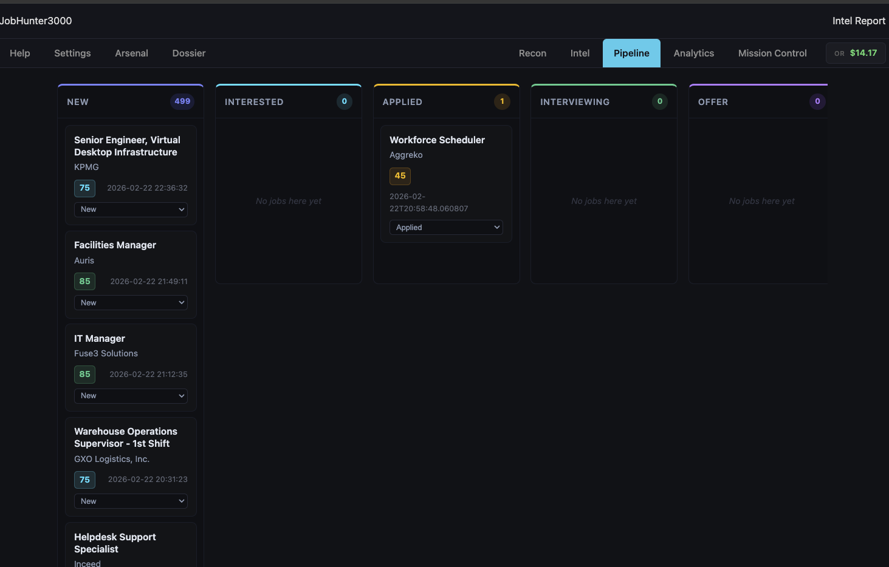
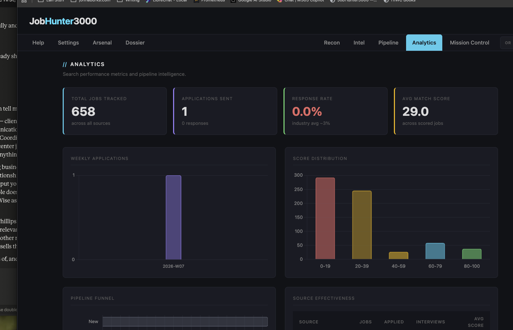
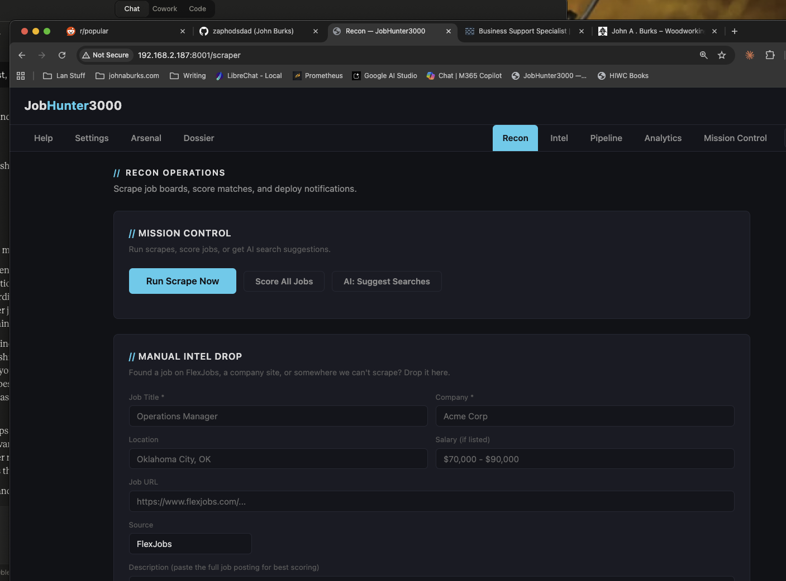
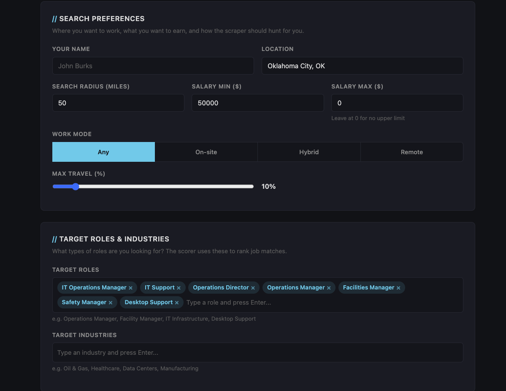

# JobHunter3000

A self-hosted job search automation platform that combines automated job board scraping, AI-powered job scoring, and tailored resume generation into a single tool. It scrapes eight major job boards on a configurable schedule, deduplicates results across sources, and scores every listing against your resume using your choice of LLM provider. Jobs scoring above your threshold trigger push notifications, and a daily email digest keeps you current without having to check the dashboard.

The web interface serves as a full pipeline tracker: browse and filter scored listings, generate tailored resumes and cover letters per posting, and move jobs through status stages from discovery to offer. Search profiles let you define multiple targeted queries with different keywords, locations, and salary floors, then run them individually or all at once. Everything runs locally — your resume data, API keys, and job search activity never leave your machine.



## Features

- **Scrapes 8 job boards** on a schedule (Indeed, SimplyHired, Dice, Rigzone, RemoteOK, WeWorkRemotely, USAJobs, ZipRecruiter)
- **AI-scores every job 0-100** against your resume with pros, cons, fit summary, ghost risk detection, and gap analysis
- **Generates tailored resumes and cover letters** per job posting (Markdown, DOCX, PDF)
- **Interview prep** — AI-generated questions with talking points from your experience
- **ATS keyword matching** — see which JD keywords you hit and which you're missing
- **Pipeline tracker** — kanban-style board from New through Offer
- **Analytics dashboard** — track applications, response rates, source effectiveness, score distribution
- **Push notifications** for high-scoring matches (Pushover)
- **Daily email digest** with top jobs and follow-up reminders
- **Anti-filters** — exclude companies, title keywords, and description keywords automatically
- **Search profiles** — run multiple targeted searches with per-profile controls
- **Completely local** — your data never leaves your machine

## Screenshots

| Pipeline Tracker | Analytics Dashboard |
|:---:|:---:|
|  |  |

| Recon — Scraper Controls | Dossier — Search Preferences |
|:---:|:---:|
|  |  |

## Tech Stack

| Component | Technology |
|-----------|-----------|
| Web UI | FastAPI + Jinja2 templates (dark theme) |
| Scraping | Playwright (headless Chromium), 8 board scrapers |
| AI Scoring | OpenRouter / Google Gemini / Ollama (configurable) |
| Resume Generation | Same LLM providers, main model |
| Notifications | Pushover (push), msmtp (email digest) |
| Charts | Chart.js |
| Storage | SQLite |
| Language | Python 3.12 |

## Quick Start

```bash
git clone https://github.com/zaphodsdad/jobhunter3000.git
cd jobhunter3000
python -m venv .venv && source .venv/bin/activate
pip install -r requirements.txt
playwright install chromium

# Run the web UI
uvicorn app:app --host 0.0.0.0 --port 8001
```

Then open http://localhost:8001 and:
1. Configure your LLM provider in **Settings**
2. Upload your resume on the **Arsenal** page
3. Review your AI-generated candidate profile on the **Dossier** page
4. Run a scrape from the **Recon** page

## LLM Provider Options

JH3000 supports three LLM backends. You need at least one configured:

### OpenRouter (Recommended)
Best selection of models, pay-per-token, no subscription.
1. Sign up at [openrouter.io](https://openrouter.io)
2. Add credits ($5 minimum, lasts a long time for scoring)
3. Go to Keys > Create Key > copy it
4. Paste into JH3000 Settings

### Google Gemini (Free Option)
Free tier with rate limits. Good for scoring.
1. Go to [ai.google.dev](https://ai.google.dev)
2. Sign in with your Google account
3. Click "Get API Key" > Create API key
4. No credit card required — free tier gives 15 requests/min on Flash, 2/min on Pro

### Ollama (Local / Advanced)
Completely free, completely private. Requires local hardware.
1. Install Ollama: [ollama.com](https://ollama.com)
2. Pull a model: `ollama pull qwen2.5-coder:32b` (or smaller)
3. Point JH3000 to your Ollama endpoint (default: `http://localhost:11434`)

## Cron (Optional)

Automate scraping and email digests:

```bash
# Scrape + score + notify every 8 hours
0 7,15,23 * * * cd /path/to/jobhunter3000 && .venv/bin/python scripts/run_scrape.py >> logs/scrape.log 2>&1

# Morning digest email at 7 AM
0 13 * * * cd /path/to/jobhunter3000 && .venv/bin/python scripts/morning_digest.py >> logs/digest.log 2>&1
```

## Project Structure

```
jobhunter3000/
├── app.py                 # FastAPI web server (port 8001)
├── services/
│   ├── db.py              # SQLite schema, queries, migrations
│   ├── scraper.py         # 8 board scrapers + pipeline orchestration
│   ├── scorer.py          # LLM job scoring, interview prep, search suggestions
│   ├── llm.py             # LLM abstraction (OpenRouter/Google/Ollama)
│   ├── generator.py       # Resume + cover letter generation
│   ├── notifier.py        # Pushover notifications
│   ├── settings.py        # Settings management
│   └── resumes.py         # Resume parsing + candidate profile
├── templates/             # Jinja2 HTML templates
│   ├── dashboard.html     # Mission Control
│   ├── jobs.html          # Intel — job listings
│   ├── job_detail.html    # Job detail with scoring, keywords, gaps, interview prep
│   ├── analytics.html     # Analytics — charts and metrics
│   ├── scraper.html       # Recon — run scrapes, AI suggestions
│   ├── pipeline.html      # Pipeline — kanban-style tracker
│   ├── profile.html       # Dossier — candidate profile editor
│   ├── resumes.html       # Arsenal — resume management
│   └── settings.html      # Settings — LLM, boards, filters
├── scripts/
│   ├── run_scrape.py      # Cron: scrape + score + notify
│   └── morning_digest.py  # Cron: daily email digest
├── data/                  # Runtime data (gitignored)
│   ├── settings.json
│   ├── candidate_profile.json
│   ├── resumes/
│   ├── generated/
│   └── jobs.db
└── logs/
```

## Navigation

| Page | URL | What It Does |
|------|-----|-------------|
| Settings | `/settings` | LLM config, search profiles, filters, boards |
| Arsenal | `/resumes` | Upload and manage resumes |
| Dossier | `/profile` | View/edit AI-generated candidate profile |
| Recon | `/scraper` | Run scrapes, score jobs, AI search suggestions |
| Intel | `/jobs` | Browse jobs with filters, scores, summaries |
| Pipeline | `/pipeline` | Track application status (kanban) |
| Analytics | `/analytics` | Charts: apps/week, funnel, scores, sources |
| Mission Control | `/dashboard` | Overview: stats, follow-ups, recent activity |

## License

MIT License. See [LICENSE](LICENSE).
